# Minimax in Battlesnake

I've been playing Battlesnake for just over a year now, and I'm having so much fun! The community is incredible, and I'm having a ton of fun trying out different strategies and algorithms trying to take those top spots!

If you don't know about Battlesnake, make sure to go check it out at [play.battlesnake.com](https://play.battlesnake.com). You play by making a 'snake' web server that receives the game state on each turn, and you have to decide which direction your snake should go!

Today let's look at the minimax algorithms and two multiplayer variations. Minimax is a popular algorithm in Battlesnake and one I've used for most of my competitive snakes.

## What is Minimax

Minimax is an algorithm designed originally for two-player, zero-sum games. It's a tree search algorithm designed to choose the "best" move by looking at several future moves and using a scoring function to determine which end states are desirable. To go into more detail, let's look at a pretty simple game, Tic Tac Toe.

## Minimax in TicTacToe

In Tic Tac Toe, there are three possible end states, so let's use that to define a 'scoring algorithm' to use. We can do a simple mapping of Loss to -1, Draw to 0 and Win to 1. In Battlesnake, we'll use a more complicated scoring function, but this will work great for Tic Tac Toe

With our scoring algorithm sorted out, let us dive into the middle of a game.

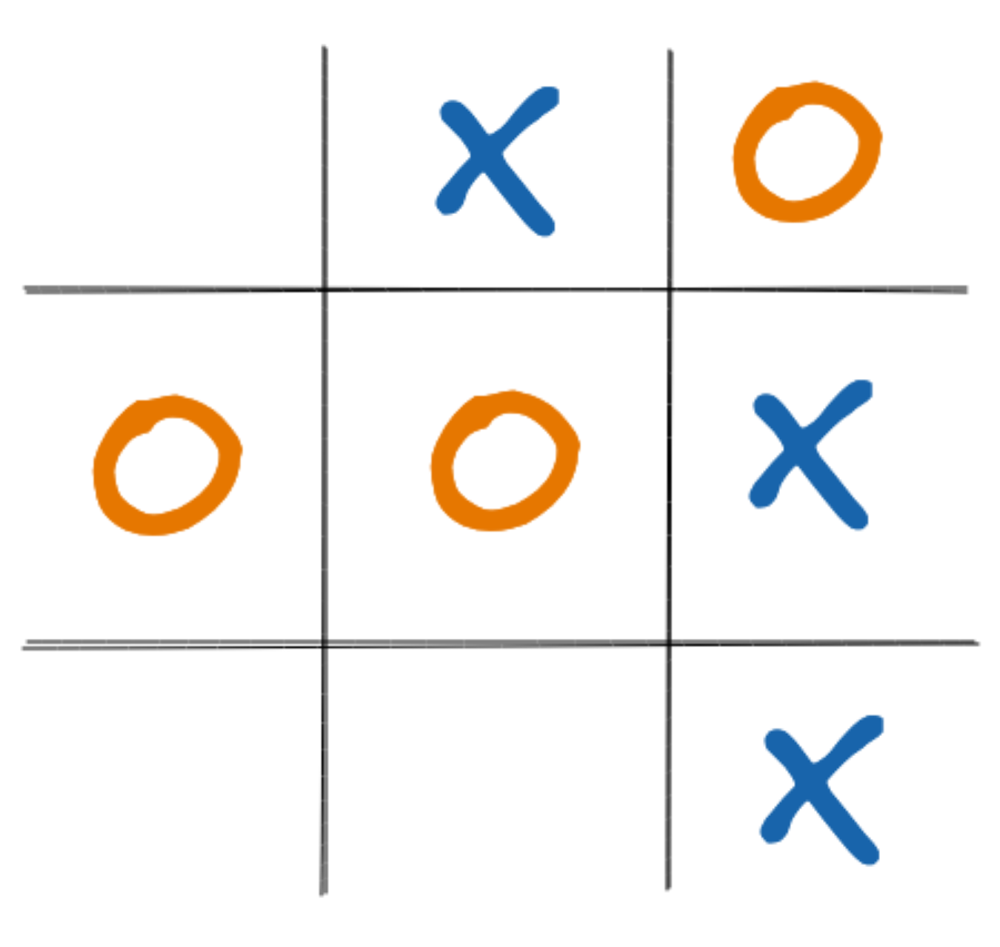

Ok, so I'm playing as X's in this game of Tic Tac Toe, and I need to decide what to do next.

I have 3 options; let's number them on our game board.

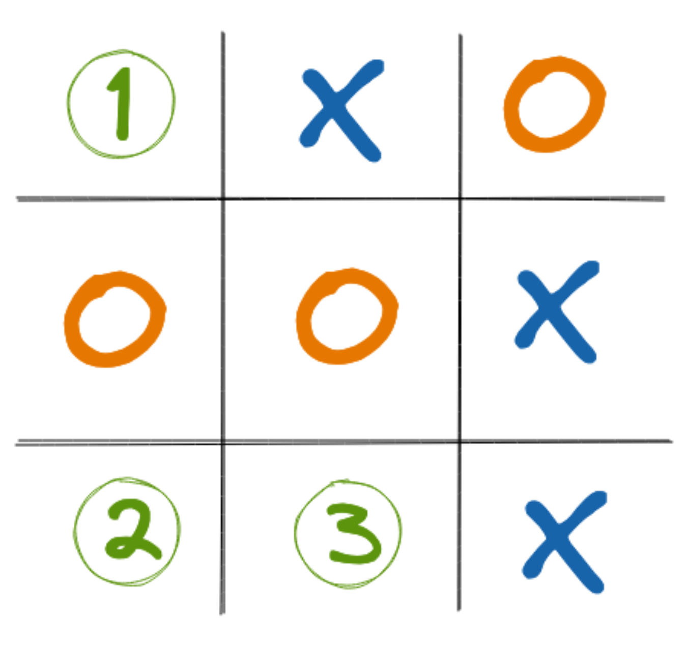

Now an experienced Tic Tac Toe player might be able to figure out where to go next on their own, but we will explore this example a bit.

I did say Minimax was a tree search, so let us draw a tree to represent the moves we could make

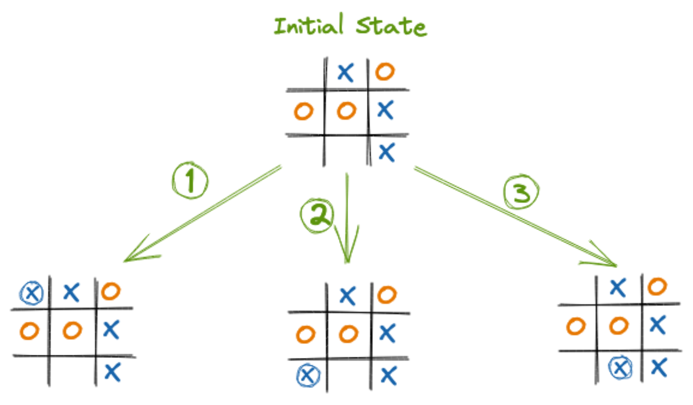

And we can complete this tree by showing all the potential moves my opponent would have next.

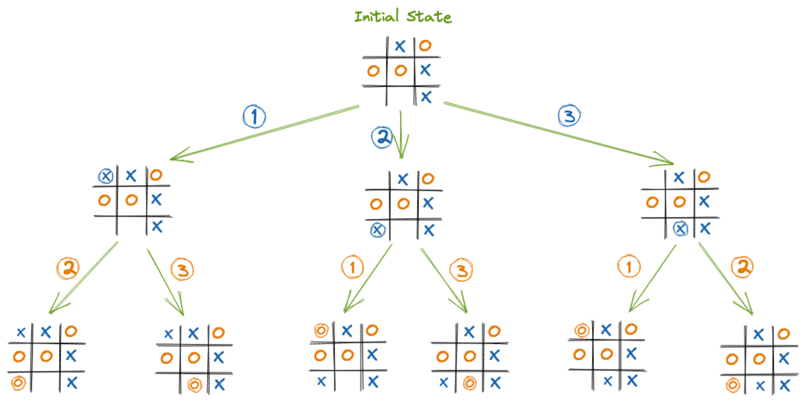

After some of these moves, the game would be over, and I would have lost; let's mark them as losses.

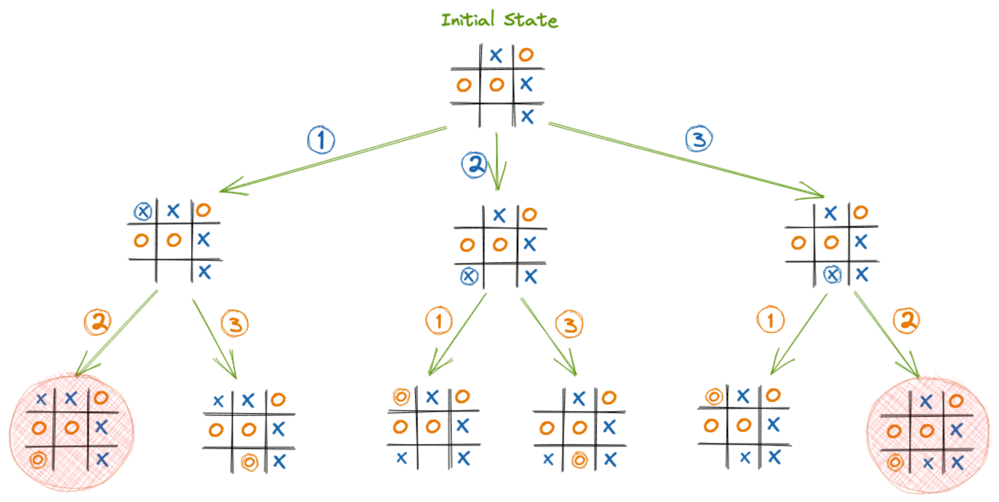

We still have some leaf nodes that aren't end-states so we can continue exploring the tree.

Ok, so now we have a complete tree of all the possible outcomes for our game! We can use the scoring algorithm we defined at the beginning to score these end states.

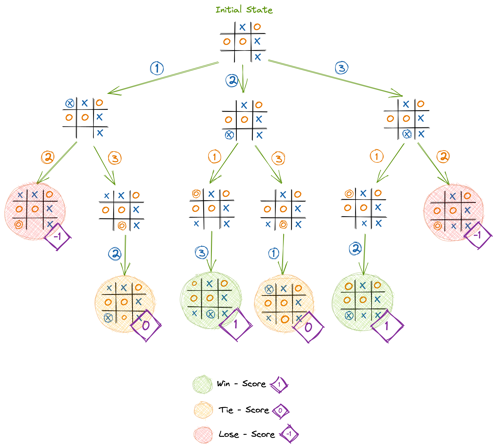

With all of our end states scored, we can score the rest of the nodes following the minimax algorithm.

Minimax works by choosing the move with the best score when it's your turn and assuming your opponent will choose whatever has the lowest score (as this is what's best for them).

Let's look at the first un-scored node (X1, 03). After this node, it is my turn, so we are maximizing the possible score. But since there is only one choice left, there isn't much to maximize. We just take the 0 from the bottom layer and assign it to our node.

We can do the same for the other single-choice nodes as well.

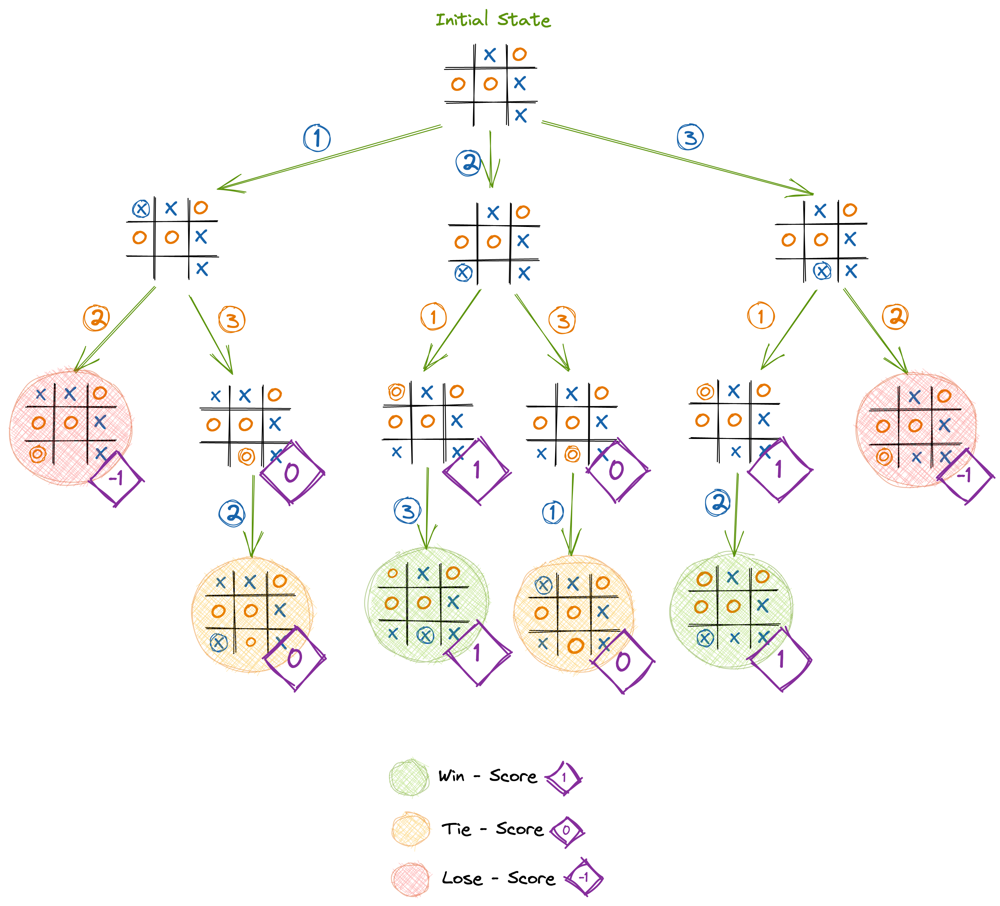

Now things get a bit more interesting! The next unscored node is (X1). After this node, it will be O's turn, so we are in a minimizing turn. We take the smallest value from the possible children. For the left most node that means we bring up the -1. For the middle node we bring up the 0 and the right node we bring up the -1

We can now do the last unscored node and score the board as it stands now. It's our turn so we take the largest score from our children. Here we propagate up the 0.

The score being 0 means that we think the best we can do is tie this game. To determine what move to make, we simply look at which node we took that score from. In this case, we got the (0) from X(2), which should be our next move. We then think our opponent will choose 0(3), forcing us to choose X(1) last, leading to a draw.

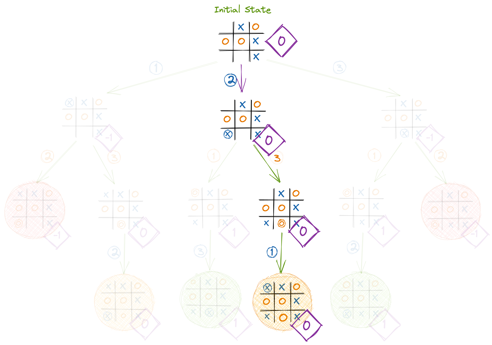

Let's look at the two options we didn't take.

If we were to make (X1), it leaves square 2 open for O, leading to the win.

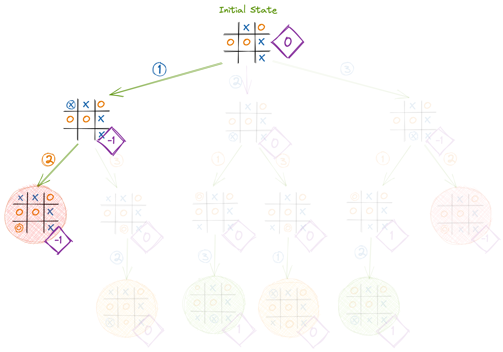

The same thing happens if we choose (X3)

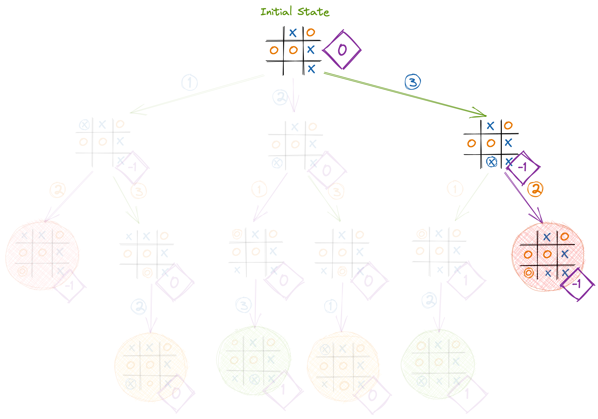

And that's basically all there is to Min Max! You take a scoring algorithm, make a tree of all the possible states, and work backward from the leaves to find the best move possible.

## Minimax Modifications

While that 'pure' version of Minimax might be enough for a game like TicTacToe, there are some modifications that are common for Battlesnake.

### Scoring Non-End States

In our TicTacToe example, we went all the way to the 'end states' and only scored these. This is the 'best' for Minimax since you will explore every move and pick which one is best. But this can take a long time, especially at the start of the game, and definitely in Battlesnake, where games can last longer. Due to the board size of TicTacToe, the total number of turns possible is always going to less than nine. A game can end quicker, but no game will take longer than nine turns. This means our move tree will only ever have to go to 'depth' nine before finding all the possible end states. However, in Battlesnake, we aren't that lucky. A short game may end after 50 turns, but a long game can take 200+ turns. This means it would take a LONG time to investigate all the possible board states.

<aside>

TicTacToe has a branching factor of K where K = 9-D, where D is the current 'depth' or turn. So the number of game states we need to explore ends up being `9!`, or 9 * 8 * 7 * .. * 2 == 362880. So from the start of a game, we need to explore over 350,000 board states. This is a LOT of board states. But in Battlesnake, it's even worse. If we look at our short game number of 50 turns, each snake has 3 options at any one time. (Technically, there are 4 possible moves, but one will always result in death, so we can only look at the 3 moves that won't lead to instant death). Let's look at a "Duels" game between only two snakes. So each snake can make 3 moves per turn, so we get 3*3==9 possible moves per turn with two snakes. [This isn't perfect cause every snake might not have 3 possible moves each time, but it will work for this estimate.] So we have 9 possible new boards per turn and 50 turns, giving us 9^50 board states to explore 5.153775207e47. We'll type that number out to show the scale a bit more, lol. 5,153,775,207,000,000,000,000,000,000,000,000,000,000,000

Wow! So Ummm, we can't possibly explore all these board states each turn. In 'normal' Battlesnake rules, you only have 500ms to respond, so even if we could look at 1000 board states every nanosecond, we wouldn't even get close to looking at all the board states in time. We need to do something so that we don't have to explore all states of the board!

</aside>

The first minimax modification is directly about reducing the number of board states we have to look at by limiting the 'depth' of the tree we explore. By not trying to reach an end state each time, we can cut off our tree and make the search space MUCH smaller. For instance, if we only look 5 turns ahead, we only have 9^5 = 59,049 board states to look at. There are still many board states, but NOTHING like our original number. This is a trade-off, though, of course. If we only look five turns ahead, we could possibly lead ourselves into a trap where we'll die on the sixth move.

We also need to come back and talk about scoring algorithms in more depth. Our scoring algorithm needs to get a bit fancier if we aren't just scoring end states. Now we need to be able to score intermediary states. Ideally, in such a way that a higher score for any given board means we are more likely to win. This can get complicated and slightly out of scope for this article. In my current snake, Hovering Hobbs, I'm using a flood-fill inspired 'area control' score to determine how much of the board Hobbs feels like they 'control'.

So now we will likely have more score states than just -1, 0, and 1. You'll likely want to use values in between there to represent the non-end states. Something like 0.8 is probably a pretty good board state where we think we might win, and conversely, -0.7 is a reasonably 'bad' board state where we believe we will lose.

Let's do an example. Like we talked about, the search tree in Tic Tac Toe will get big fast, so let's only go down to a "depth" of two.

I'm going to call going down a single layer in the search tree going down a "depth". This will be more important later when we get to Battlesnake, where a "turn" will be different than the "depth" since snakes move all at once. But back to tic-Tac-toe for now.

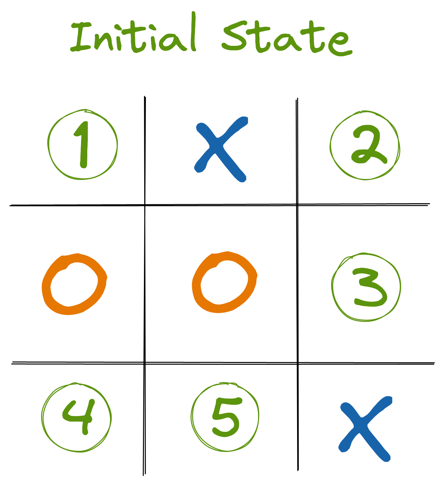

Here is the initial board state we are going to use. It's Xs move, and the options are numbered. We can draw out the possibilities at the start of the game tree.

We won't draw out this whole tree, but we'll focus on one branch.

And this is where we will do something different from the 'full' Minimax. Instead of continuing down the tree, we'll score these unfinished games states. We aren't going to define a specific scoring function, just remember that lowers score are bad and higher scores are good.

Since our 'opponent' was moving for that branch, this is a minimizing node. Meaning we take the smallest possible score and populate it up. In this case, that's `-1` for a loss cause one of our depth 2 nodes was ALSO a leaf node. We don't do anything special, but its score is the same as the loss end states we scored before.

Propagating up the tree works precisely the same as before. We'd also want to do the same in the sub-trees we didn't look at, but for times sake I'm just going to fill in their scores.

Since it's our move now, we look for the maximizing answer. Here that is option 3 with a score of 0.5. All the other moves end in certain death for us!

This allows us to decide without looking at the complete tree of possibilities! Here it helped us avoid a sure loss, only going down to a depth of two.

### Multiplayer Minimax

So far, we've been looking at a two-player game with tic-tac-toe. Battlesnake can be two-player, in Duels mode. But it's often more than that. The Spring League 2022 is "Wrapped" with 4 snakes on the board at once.

There are multiple variations of Minimax made for more than two players. The two we will talk about are "Paranoid Minimax" and "MaxN."

We'll look at the same example using both variations. Since they only differ in the scoring and propagation of scores, we'll look at how we build up our tree first.

This works basically the same as before, but we'll walk through an example to illustrate.

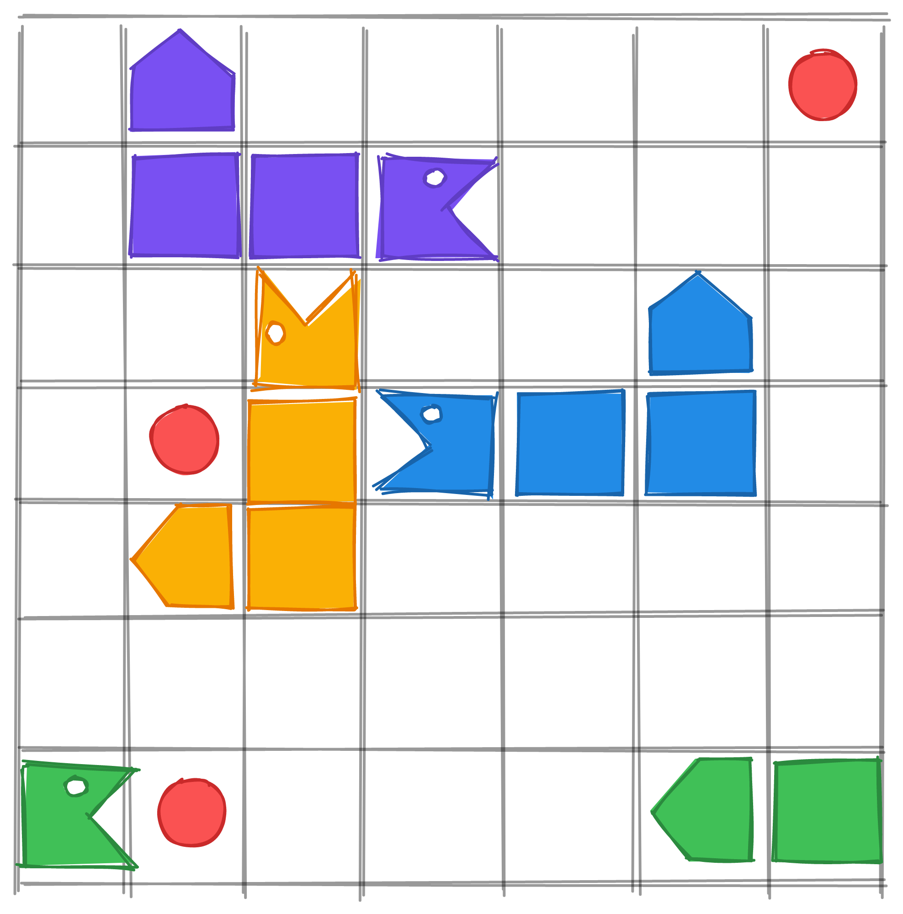

This is the Battlesnake game board we are going to look at. We are playing as the Purple snake here and want to decide which move to make next. Ignoring the 'Left' where we would immediately move into our own body, here are our three options.

And we can draw this out into the first layer of our graph.

Next, it's going to be the Orange snakes turn. We want to branch down from ALL three of our current 'leaf' nodes with the choices for Orange. However, here we are only going to look at the left-most sub-tree to save ourselves from having to draw out everything!
Here is what that first sub-tree looks like when we draw out Orange's moves

And then it's the Blue snake's move, again only drawing the first sub-tree

And finally, we can finish this one "turn" and draw out the first sub-tree for the Green snake's move.

Ok! We've drawn out our game tree, so we are reading to start scoring and propagating scores up the tree. So now it's time to talk about our two variations, Paranoid Minimax and MaxN.

#### Paranoid Minimax

Let's start with Paranoid Minimax! This is the first version I implemented, and I think it's a more minor variation of what we talked about already.

Paranoid Minimax gets its name by being 'paranoid' and thinking all the opponents are out to get you specifically. We keep the scoring algorithm 'rules' the same as before. Lower numbers are worse for you, and higher numbers are better for you, states where you are more likely to win.

When we are propagating scores up the tree, we only take the largest score if we are the one moving at that depth. At all other depths, we choose the smallest available option.

Let's dive in! Starting from the game tree we just made, we will score all the leaf nodes, where a lower score is worse for us, the Purple snake, and higher scores are better.

Since Green's turn led to these leaf nodes, and Green is NOT us, we will choose the lowest score. In this example, the score is `-0.2`, and we propagate that up to our parent node.

And now we can continue propagating up. Next, it's Blue's turn, and again we are taking the minimizing score. Reminder, I'm filling in the scores for the parts of the graph we didn't explore, but we'd be repeating the algorithm in each subtree in real life.

After this, it's Orange's turn, and once again, we are taking the smallest possible score.

And it's finally our Purple snake's turn! This means we can pick the highest score, and whichever direction this score came from is the move we will choose.

So going down to a depth of 4, which is one "turn" of Battlesnake, we decided that we wanted to move "Right".

Paranoid Minimax says that according to our scoring function and assuming all opponents are working together against us, going Right gives us the highest possible score.

#### MaxN

MaxN is another common variation. And again, we keep the same basic graph traversal. But we change out the scoring function. Instead of having lower scores always be bad for you, we score based on each of the snakes currently in play. And then, when we propagate up the tree, we always choose the highest score for the snake that's moving.

Let's see what that looks like. Again we are going to start with our full game tree created. This is copied from above to remind ourselves what that looks like.

Now we need to score our leaf nodes. And instead of producing a single score per node, we will produce four scores per node, one for each snake. The scores will be from the 'perspective' of each snake but follow the same rules as before: higher numbers are better, and low numbers are worse.

Scoring the leaf nodes might look something like this. We have a  score for each snake, shown in the same color as the Snake.

We can start propagating up the tree with all of our leaf nodes scored. In MaxN, we always choose the highest score for our snake.
For the Green, that means we will take the '0' from moving 'Up'.

Let's keep moving up the tree. Blue's turn is next.

Here Blue chooses 'Down' since it maximizes its personal score. We can notice that this actually worked to our/Purple's advantage here! The best move for Blue was _also_ the best move for us. This is different from Paranoid Minimax, which would never choose a branch that was better for us during the opponent's turn.

Orange's turn works the same way; we choose whichever option has the best score for Orange. Picking 'Left' in this situation.

We made it all the way up our tree and can choose the score for our Purple snake. As with all the other nodes, we select the best move for us. Choosing 'Up' in this example.

This is different from the result we got from Paranoid Minimax! We decided to go 'Right,' and with MaxN, we chose 'Up.'

#### Advantages and Disadvantages

I don't know which is best; I don't think there is really a correct answer to that question. Each has its strengths and weaknesses.

In terms of modeling the Battlesnake game, I think MaxN _feels_ better. Snakes are doing what's best for themselves, not only what's bad for you.

Paranoid Minimax has an advantage we haven't really talked about yet, "Alpha Beta Pruning". Alpha Beta Pruning is an enhancement to Minimax. Essentially it works by eliminating whole sub-trees that couldn't change the score we propagate up. It works in Minimax and our Paranoid variant because we always look at a consistent score. In MaxN, since we have multiple scores for a node and propagate based on the score of the moving snake, we can't make this enhancement.
Alpha/Beta can significantly reduce the search tree and make Paranoid faster to get to the same depth.

MaxN also has the disadvantage of scoring nodes multiple times, once for each snake. When the scoring function is expensive, this can slow down the total runtime of the search; since (even ignoring any Alpha/Beta) we would have to do four times the number of score invocations in a four snake game.

Thanks for making it to the end!

If you want to chat about the article, you can find me in the [Battlesnake Discord as @coreyja](https://play.battlesnake.com/discord/)
or on [Twitter as @coreyja_dev](https://twitter.com/coreyja_dev)

Edits:
- @shayden on Discord pointed out an error in the Tic Tac Toe example and diagrams. One of the leaf nodes was marked a tie, when it should have been marked a loss. The diagrams have been updated and the text changed to reflect the correct scoring. Thanks @shayden!
